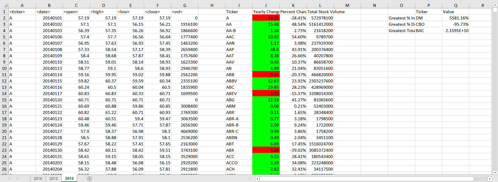
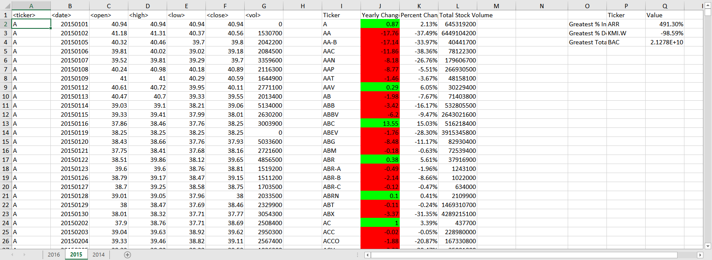

# Yearly Stock Analysis

This is an example of how to cycle through each worksheet in an Excel file using Visual Basic and process the data in a look ahead fashion. The particular dataset in this case is a history of stock values from 2014 to 2016.   The data is sorted in a chronological fashion and contains opening, high, low, closing, and volume data on daily basis.  The logic is to grab the opening value of a stock on the first day of the year and the closing value on the last day year and calculate the change over the year both numerically and percentage wise.  Additionally, the volume over the year is also captured as a sum so that you get a notition share activity for the whole year.  There is also some analysis on the side bar that shows the stock that has the greatest percent increase, greatest percent decrease, and the greatest volume. 

## Files

* Original Unchanged Excel Files

  * [Test Data](Resources/originals/alphabetical_testing.xlsx) - Test file with smaller data set arranged alphabetical by sheet. 
  * [Original Stock Data](Resources/originals/Multiple_year_stock_data.xlsx) - Original stock data arranged by year on each sheet with no Visual Basic macro included.

* Excel File with Visual Basic Macro
  
  *  [Final Stock Data](Multiple_year_stock_data-final.xlsm) - Stock data with Visual Basic macro included, includes the generated summary tables for change, volume and greatest stocks
  
* Visual Basic Macro Code

  * [Visual Basic Module](processStocks.bas) - Visual Basic code exported from the [Final Stock Data](Multiple_year_stock_data-final.xlsm) for review
  
  
  
##   Results using [Final Stock Data](Multiple_year_stock_data-final.xlsm)

* 2014

* 2015

* 2016

  
  
  